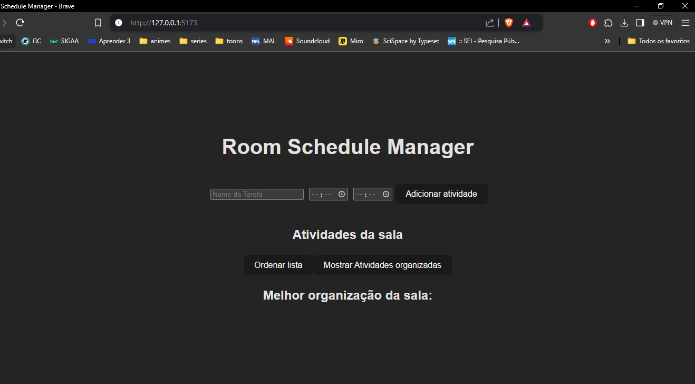
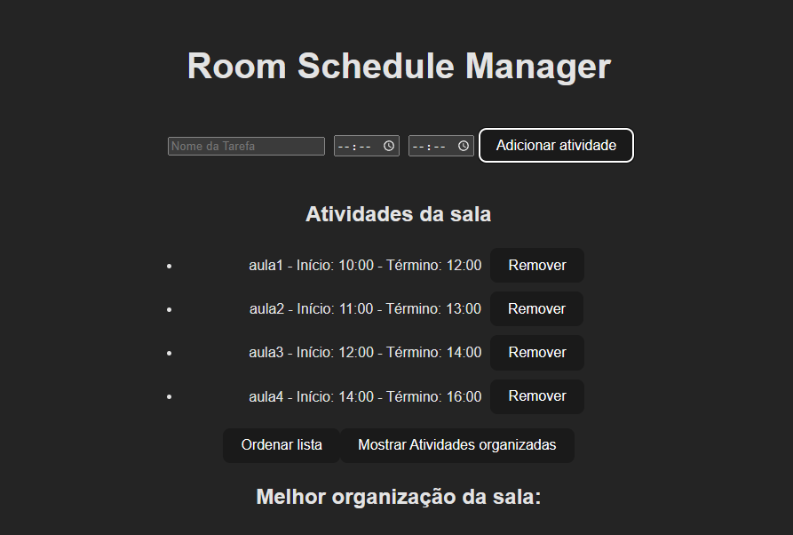
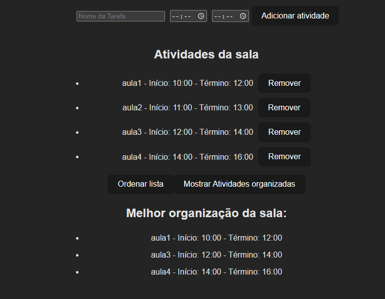

# Rooms Schedule Manager (RSM)

**Número da Lista**: X 
**Conteúdo da Disciplina**: Algoritmos ambiciosos 

## Alunos
|Matrícula | Aluno |
| -- | -- |
| 20/0059980  |  Pedro Miguel Martins de Oliveira dos Santos |
| 19/0097043  |  Yves Gustavo Ribeiro Pimenta |

## Sobre 

Temos como objetivo organizar a escala de algumas ou todas as salas da Faculdade do Gama

Como funciona?

- Realizamos a ordenação das atividades por quick sort
- Depois, realizamos a organização das atividades por meio do interval scheduling

## Screenshots

## Instalação 
**Linguagem**: JavaScript 
**Framework**: ViteJS 

## Uso 

- Rode npm install na pasta PD-RSM
- Depois rode npm run dev que gerará o site

## Outros 
Quaisquer outras informações sobre seu projeto podem ser descritas abaixo.

